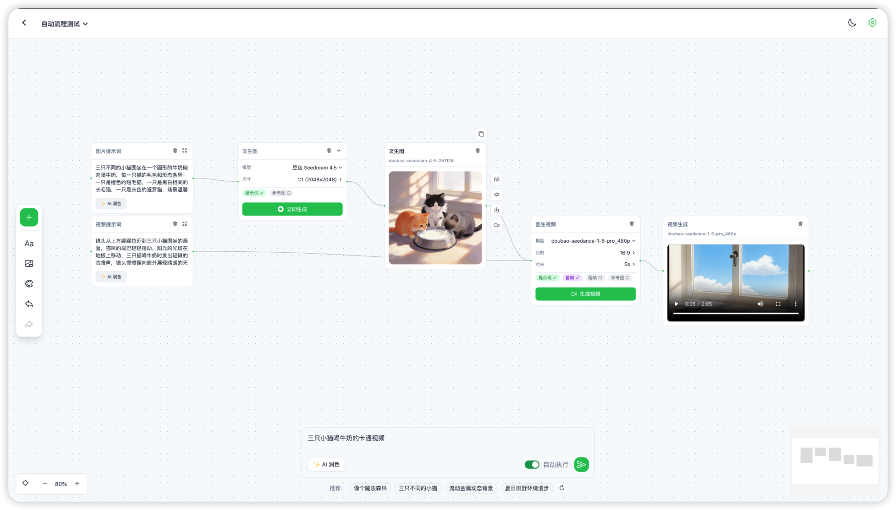
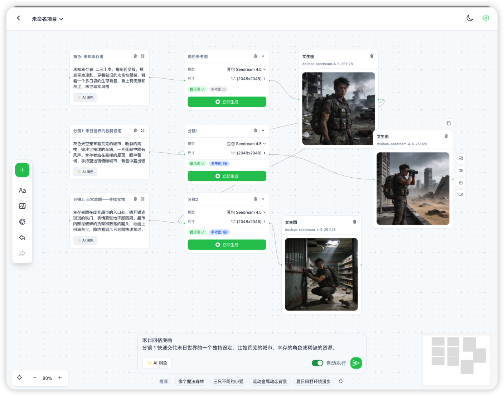

# 龙城无限画布

后续开发
我想增加如果是文案增加按钮 【生声音】 按钮，设计一下页面，下载里面增加这个语音下载，先支持一下 minimax的 speech-2.8-hd 
一个基于 Vue Flow 的可视化 AI 创作画布，支持文生图、视频生成等 AI 工作流的节点式编排。
[线上地址](https://canvas.aiaiai001.com/)


## 📸 截图

### 首页


### 画布


### API 配置


## ✨ 特性

- 🎨 **可视化节点编排** - 基于 Vue Flow 的无限画布，支持拖拽、缩放、连接
- 🖼️ **文生图工作流** - 支持配置提示词、模型、尺寸等参数生成图片
- 🎬 **视频生成工作流** - 支持图生视频，可设置首帧/尾帧图片
- 🤖 **AI 提示词润色** - 一键 AI 优化提示词，提升生成质量
- 🌓 **深色/浅色主题** - 支持主题切换，保护眼睛
- 💾 **本地项目存储** - 项目数据本地持久化，支持多项目管理
- ↩️ **撤销/重做** - 完整的操作历史记录
- 🔄 **多渠道 API 支持** - 支持龙城(Chatfire)、MiniMax、自定义转发等多种渠道

## 📦 节点类型

| 节点         | 描述                            |
| ---------- | ----------------------------- |
| **文本节点**   | 输入/编辑提示词文本，支持 @ 引用图片节点        |
| **文生图配置**  | 配置图片生成参数（模型、尺寸、数量、质量等）        |
| **图片节点**   | 展示生成的图片或上传本地图片，支持多图选择         |
| **视频生成配置** | 配置视频生成参数（模型、分辨率、时长，支持首帧/尾帧图片） |
| **视频节点**   | 展示生成的视频，支持进度显示和下载             |
| **LLM 配置** | 配置大语言模型参数                     |

## 🚀 快速开始

### 环境要求

- Node.js >= 18
- pnpm / npm / yarn

### 安装

```bash
# 克隆项目
git clone https://github.com/uzi490/shengtu.git
cd shengtu

# 安装依赖
pnpm install
# 或
npm install

# 启动开发服务器
pnpm dev
# 或
npm run dev
```

### 构建

```bash
pnpm build
# 或
npm run build
```

## ⚙️ API 配置

### 渠道说明

支持多种 API 渠道切换，进入「API 设置」后可选择：

| 渠道                | Base URL                       | 说明                         |
| ----------------- | ------------------------------ | -------------------------- |
| **龙城 (Chatfire)** | `https://api.aiaiai001.com`   | 默认渠道，支持 OpenAI 兼容接口        |
| **MiniMax**       | `https://api.minimaxi.com`     | MiniMax 原生 API             |
| **自定义(MiniMax)**  | 可配置                            | 走用户自己的转发服务，复用 MiniMax 适配逻辑 |
| **OpenAI**        | `https://api.chatfire.cn`      | OpenAI 格式兼容                |

### 配置步骤

1. 点击右上角设置图标 ⚙️
2. 选择所需渠道
3. 填入 API Base URL 和 API Key（自定义渠道需填转发服务地址和你的 API Key）
4. 选择需要使用的模型

### 润色功能

AI 提示词润色默认使用 `MiniMax-M2.7` 模型，会将当前选中的渠道切换到 MiniMax 适配器进行请求。

## 🛠️ 支持的模型

### 图片模型

| 模型                               | 渠道      | 说明           |
| -------------------------------- | ------- | ------------ |
| Nano Banana 2 / Pro              | 龙城      | 快速图片生成       |
| 豆包 Seedream 4.5                  | 龙城      | 高质量图片，支持 4K  |
| MiniMax image-01 / image-01-live | MiniMax | MiniMax 原生生图 |

### 视频模型

| 模型                           | 渠道      | 说明                           |
| ---------------------------- | ------- | ---------------------------- |
| Seedance 1.5 Pro             | 龙城      | 图文视频，支持 5s/10s               |
| Seedance 1.0 Lite            | 龙城      | 文生视频/图生视频                    |
| Seedance 1.0 Pro Fast        | 龙城      | 快速图文视频                       |
| Hailuo-2.3 / Hailuo-2.3-Fast | MiniMax | 文生视频/图生视频，支持 720P/768P/1080P |

### 对话模型

| 模型                                    | 渠道          |
| ------------------------------------- | ----------- |
| GPT-4o Mini / GPT-4o / GPT-5.2        | OpenAI      |
| DeepSeek Chat                         | OpenAI / 龙城 |
| 豆包 Seed Flash                         | 龙城          |
| Gemini 3 Pro                          | OpenAI      |
| MiniMax-M2.7 / MiniMax-M2.7-Lightning | MiniMax     |

## 🔄 自动执行工作流

开启「自动执行」模式后，系统会通过 AI 分析用户意图，自动编排并执行工作流。

### 工作流类型

| 类型                       | 触发条件                 | 说明        |
| ------------------------ | -------------------- | --------- |
| `text_to_image`          | 默认                   | 文生图工作流    |
| `text_to_image_to_video` | 包含"视频"、"动画"等关键词      | 文生图生视频工作流 |
| `storyboard`             | 包含"分镜"、"场景"、"镜头"等关键词 | 分镜工作流     |

### 工作流 1: 文生图 / 文生图生视频



### 工作流 2: 分镜工作流 (Storyboard)



**示例输入:** `蜡笔小新去上学。分镜一：清晨的战争；分镜二：出发的风姿`

**AI 解析:**

- 提取角色: 蜡笔小新 (外观描述)
- 拆分分镜: 清晨的战争、出发的风姿

**执行流程:**

1. 生成角色参考图
2. 依次生成各分镜图片 (连接角色参考图保持一致性)

### 执行流程

1. **AI 意图分析** - 分析用户输入，判断工作流类型，生成优化后的提示词
2. **创建节点** - 按顺序创建文本节点和配置节点
3. **串行执行** - 配置节点自动执行，等待上一步完成后再执行下一步
4. **输出结果** - 生成图片/视频节点展示结果

### 核心组件

- `useWorkflowOrchestrator` - 工作流编排器 Hook
- `waitForConfigComplete` - 等待配置节点完成
- `waitForOutputReady` - 等待输出节点就绪

## 🏗️ 项目结构

```
src/
├── api/              # API 请求封装
│   ├── chat.js       # 对话/润色 API
│   ├── image.js      # 图片生成 API
│   └── video.js      # 视频生成 API
├── components/       # Vue 组件
│   ├── nodes/        # Vue Flow 节点组件
│   │   ├── TextNode.vue        # 文本节点
│   │   ├── ImageConfigNode.vue # 文生图配置节点
│   │   ├── ImageNode.vue       # 图片节点
│   │   ├── VideoConfigNode.vue # 视频配置节点
│   │   ├── VideoNode.vue       # 视频节点
│   │   └── LLMConfigNode.vue  # LLM 配置节点
│   └── edges/        # Vue Flow 边组件
├── config/           # 配置文件
│   ├── models.js     # 模型列表配置
│   └── providers.js  # API 渠道适配器配置
├── hooks/            # 组合式函数 (Vue Composables)
│   ├── useApi.js             # API 调用封装
│   ├── useApiConfig.js       # API 配置管理
│   ├── useProvider.js        # 渠道切换管理
│   └── useWorkflowOrchestrator.js # 工作流编排
├── stores/           # 状态管理 (Pinia)
│   └── pinia/        # Pinia stores
├── utils/            # 工具函数
│   ├── request.js    # Axios 封装
│   └── constants.js  # 常量定义
└── views/
    └── Canvas.vue    # 主画布页面
```

## 🛠️ 技术栈

- **框架**: [Vue 3](https://vuejs.org/) + [Vite](https://vitejs.dev/)
- **画布**: [Vue Flow](https://vueflow.dev/)
- **UI 组件**: [Naive UI](https://www.naiveui.com/)
- **样式**: [Tailwind CSS](https://tailwindcss.com/)
- **图标**: [@vicons/ionicons5](https://www.xicons.org/)
- **路由**: [Vue Router](https://router.vuejs.org/)
- **状态管理**: [Pinia](https://pinia.vuejs.org/)

## 🔧 维护与发布流程

本项目的长期维护目录是 `C:\Users\龙城\Documents\longcheng-canvas`，GitHub 仓库是 `https://github.com/uzi490/shengtu.git`。`C:\Users\龙城\Downloads\dist` 只当作旧部署包来源，不再作为源码维护目录。

推荐流程：

1. 所有人先从 GitHub 拉最新 `main`，不要直接改服务器上的静态文件。
2. 新功能在分支里开发，确认能本地构建后再合并回 `main`。
3. `main` 通过构建后，再把 `dist/` 发布到首尔服务器的 `canvas.aiaiai001.com`。
4. 紧急线上修复也要补回 GitHub，保证 GitHub 永远是最新源码。

本地部署备份放在 `deployments/`，依赖目录 `node_modules/` 和构建产物 `dist/` 不提交到 GitHub。

## 🤝 贡献

欢迎提交 Issue 和 Pull Request！

1. Fork 本仓库
2. 创建特性分支 (`git checkout -b feature/amazing-feature`)
3. 提交更改 (`git commit -m 'Add amazing feature'`)
4. 推送到分支 (`git push origin feature/amazing-feature`)
5. 提交 Pull Request

## 📄 License

[MIT](./LICENSE)
